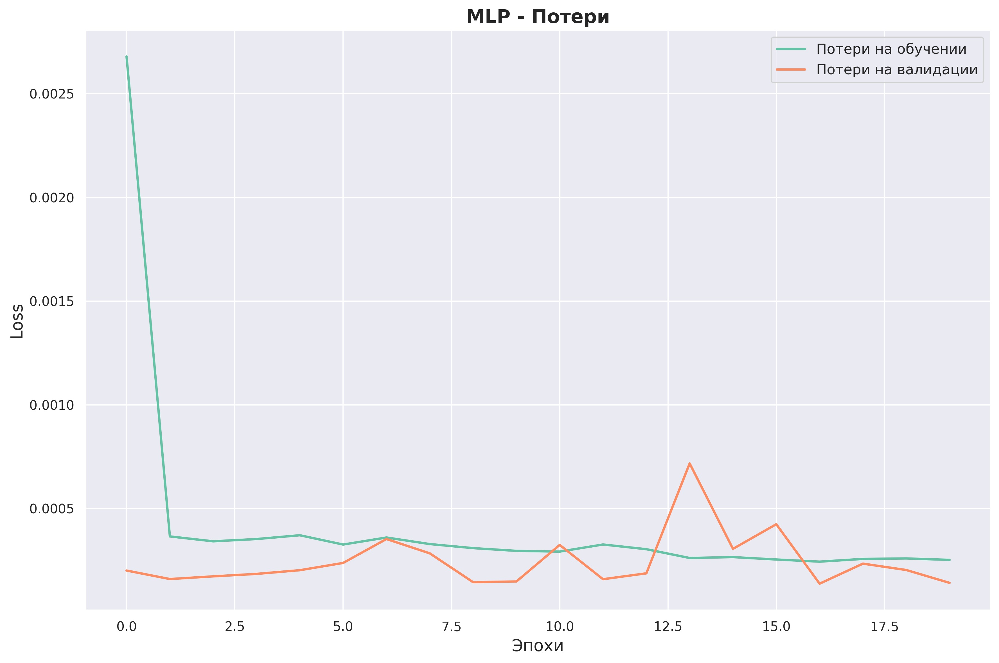

# Прогнозирование температуры с использованием нейронных сетей

Этот проект посвящён разработке и анализу моделей машинного обучения для задачи прогнозирования температуры с использованием временных рядов. В рамках работы были обучены и протестированы три модели нейронных сетей, включая:
- Модель MLP (Multilayer Perceptron).
- Модель RNN (Recurrent Neural Network).
- Модель LSTM (Long Short-Term Memory).

## Функционал
- **Предварительная обработка данных**: Нормализация температурных данных, создание временных последовательностей для модели.
- **Разделение данных**: Данные были разделены на обучающую, валидационную и тестовую выборки.
- **Обучение моделей**: Перебор гиперпараметров и обучение нейронных сетей для оптимального прогнозирования температуры.
- **Оценка качества моделей**: Использование метрик, таких как MSE, MAE и R² для оценки точности моделей на тестовых данных.
- **Визуализация процесса обучения**: Построение графиков обучения (потери и метрики) для каждой модели.
- **Визуализация метрик**: Отображение ключевых метрик качества моделей на тестовых данных в виде диаграмм.

## Зависимости
Для работы программы необходимы следующие библиотеки:
- `numpy` и `pandas` для обработки данных.
- `scikit-learn` для вычисления метрик и разделения данных.
- `matplotlib` и `seaborn` для визуализации графиков обучения и метрик.
- `tensorflow` для построения и обучения нейронных сетей.

## Установка и запуск проекта
1. Клонируйте репозиторий:
```
git clone https://github.com/Sogato/NNATA-lab5.git
```
2. Создайте виртуальное окружение:
```
python -m venv env
```
3. Установите зависимости проекта:
```
pip install -r requirements.txt
```
4. Запустите программу:
```
python main.py
```

## Описание набор а данных

Набор данных содержит историческую информацию о погоде в городе Волгоград за период с 15 октября 2012 года по 15 октября 2020 года. Данные были собраны с интервалом в один час и включают следующие столбцы:

- **LocalTime**: Временная метка, представляющая дату и время измерения.
- **T**: Температура воздуха в градусах Цельсия.
- **P0**: Атмосферное давление на уровне моря (гПа).
- **P**: Атмосферное давление на уровне станции (гПа).
- **U**: Влажность воздуха (%).
- **DD**: Направление ветра (обычно представляется в виде категориальных данных).

Для задач прогнозирования температуры были оставлены только следующие столбцы:
- **LocalTime**
- **T**

Остальные столбцы (**P0**, **P**, **U**, **DD**) были удалены как нерелевантные для текущей задачи.

Для прогнозирования температуры на следующий день использовалась техника создания временных окон. На основе исторических данных были созданы временные последовательности длиной 7 часов, где:

- **Входные данные (X)**: Включают значения температуры за предыдущие 7 часов.
- **Целевая переменная (y)**: Температура на следующий час после выбранного окна.

Таким образом, модель обучается на задаче прогнозирования температуры на один час вперед, используя данные за предыдущие 7 часов.

Данные были разделены на три части:
- **Обучающая выборка** (70% данных): Использовалась для обучения моделей.
- **Валидационная выборка** (15% данных): Использовалась для подбора гиперпараметров и предотвращения переобучения.
- **Тестовая выборка** (15% данных): Использовалась для оценки качества моделей на данных, которые не использовались в процессе обучения.

## Подбора гиперпараметров:
- Для подбора гиперпараметров варьировалось количество нейронов (`32, 64, 128, 256, 512, 1024`) и уровень Dropout (`0.1, 0.2, 0.3, 0.4, 0.5`).
- Обучение проводилось в течение 20 эпох с использованием оптимизатора Adam и функции потерь MSE.

## Архитектуры нейронных сетей

### MLP (Multilayer Perceptron)
**Описание архитектуры**:
- Многослойный персептрон (MLP) представляет собой полносвязную нейронную сеть с двумя скрытыми слоями. 
- Каждый скрытый слой содержит `neurons` нейронов с функцией активации ReLU и слоем Dropout для регуляризации.

**Лучшие параметры**:
- **1024 нейрона**, **Dropout 0.1**

**Результаты на тестовых данных**:
- **MSE**: 0.000142
- **MAE**: 0.00869
- **R²**: 0.9954

### RNN (Recurrent Neural Network)
**Описание архитектуры**:
- Рекуррентная нейронная сеть (RNN) использует рекуррентные связи между нейронами для моделирования временной динамики данных.
- Сеть содержит один слой SimpleRNN с `neurons` нейронами и функцией активации ReLU, а также слой Dropout для регуляризации.

**Лучшие параметры**:
- **1024 нейрона**, **Dropout 0.5**

**Результаты на тестовых данных**:
- **MSE**: 0.000163
- **MAE**: 0.00892
- **R²**: 0.9947

### LSTM (Long Short-Term Memory)
**Описание архитектуры**:
- LSTM — это тип рекуррентной нейронной сети, которая способна обучаться долгосрочным зависимостям в данных благодаря использованию специальной структуры ячеек с механизмами входа, выхода и забывания.
- Сеть содержит один слой LSTM с `neurons` нейронами, функцией активации ReLU и слоем Dropout для регуляризации.

**Лучшие параметры**:
- **512 нейрона**, **Dropout 0.1**

**Результаты на тестовых данных**:
- **MSE**: 0.000155
- **MAE**: 0.00908
- **R²**: 0.9950

## Графики обучения для архитектур нейронных сетей с лучшими характеристиками эффективности

### MLP - Потери на обучении и валидации


### RNN - Потери на обучении и валидации


### LSTM - Потери на обучении и валидации


## Оценки моделей на тестовых выборках в виде диаграмм, отображающих метрики качества

### MLP - Метрики на тестовых данных


### RNN - Метрики на тестовых данных


### LSTM - Метрики на тестовых данных


## Заключение
- Все три модели (MLP, RNN, LSTM) показали высокую точность прогноза на тестовых данных, о чем свидетельствуют низкие значения MSE и MAE, а также высокий коэффициент детерминации R².
- **MLP** с конфигурацией 1024 нейрона и Dropout 0.1 продемонстрировала наилучшие результаты по метрике MSE и R², что делает её предпочтительным выбором для задачи прогнозирования температуры.
- Несмотря на высокие результаты RNN и LSTM, их обучение требует больше времени и вычислительных ресурсов, чем MLP.


---

Подготовлено в рамках учебного проекта. Все данные взяты из открытых источников и использованы исключительно в образовательных целях.

---
